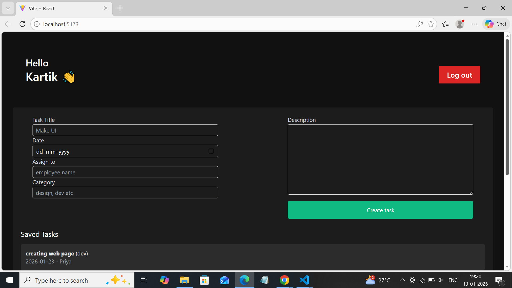
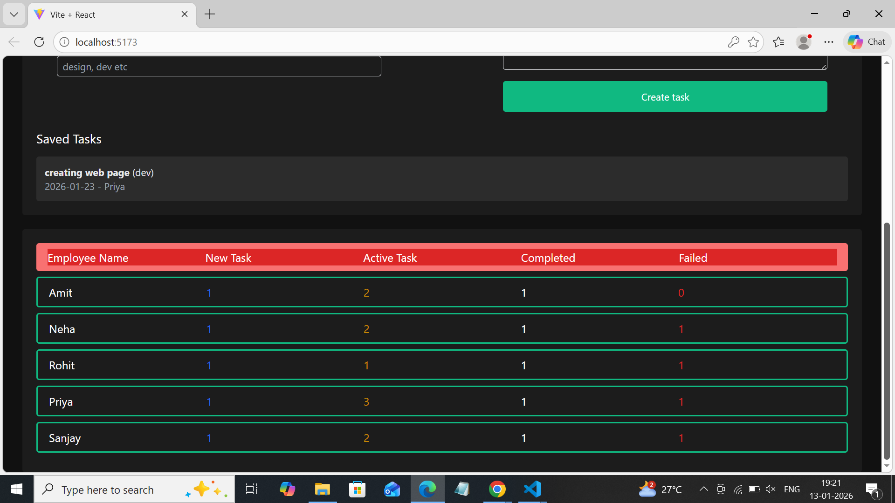

# Employee Dashboard

A React-based employee dashboard that displays tasks for each employee. It shows counts of New, Active, Completed, and Failed tasks, and lists all tasks in cards with category and status.

---

## Features

- View task counts (New, Active, Completed, Failed) per employee
- View detailed task list with task title, description, category, and date
- Tasks are categorized into Reporting, Meeting, Development, QA, etc.
- Tasks show status: Active, New, Completed, Failed
- Responsive UI styled with Tailwind CSS
- LocalStorage is used to store and retrieve employee data

---

## Technologies Used

- React.js
- Tailwind CSS
- JavaScript (ES6)
- LocalStorage

---

## Usage

After starting the app, you can view employee task summaries and task cards.
Task cards are color-coded by status.
Task counts are displayed at the top of the dashboard.
All data is fetched from LocalStorage (pre-populated with sample employee data)

## Sample Employee Data

You can use the following credentials to login and explore the dashboard.  
*(All passwords are for demo purposes only)*

### Individual Sample Employee
- **Email:** employee1@example.com  
- **Password:** 123  

### Other Sample Employees

| Name   | Email                  | Password |
|--------|------------------------|----------|
| Amit   | employee1@example.com  | 123      |
| Neha   | employee2@example.com  | 123      |
| Rohit  | employee3@example.com  | 123      |
| Priya  | employee4@example.com  | 123      |
| Sanjay | employee5@example.com  | 123      |

## Screenshots

Here are some screenshots of the Employee Dashboard:

### Dashboard Overview(Admin)


### Task List Cards


### Task Counts



## Planned Features

- Add task creation, editing, and deletion
- Filter tasks by category or status
- Notifications for upcoming tasks or deadlines
- Dark/light mode toggle


## Installation

1. **Clone the repository:**

```bash
git clone https://github.com/YourUsername/employee-dashboard.git

